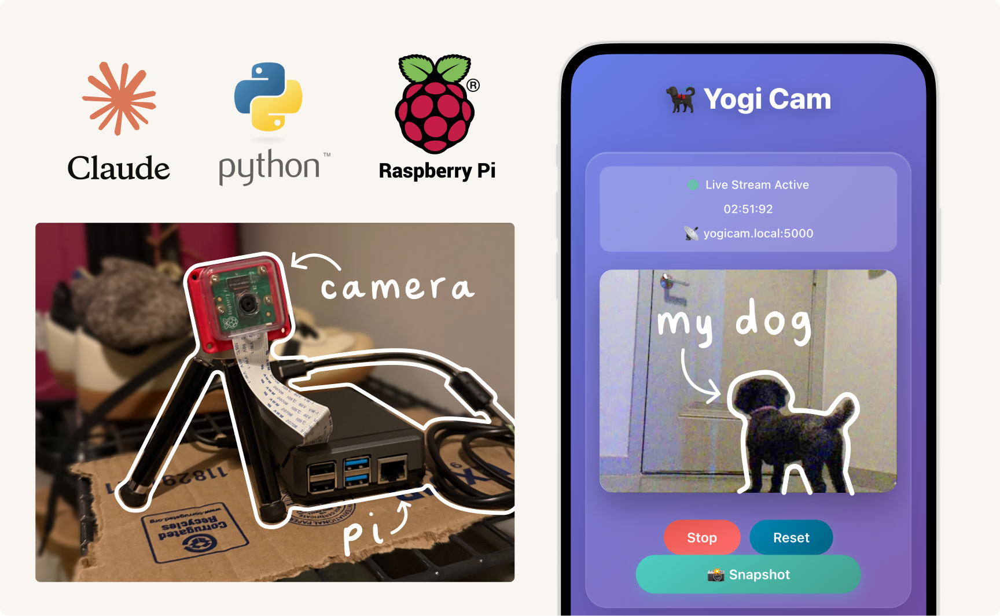
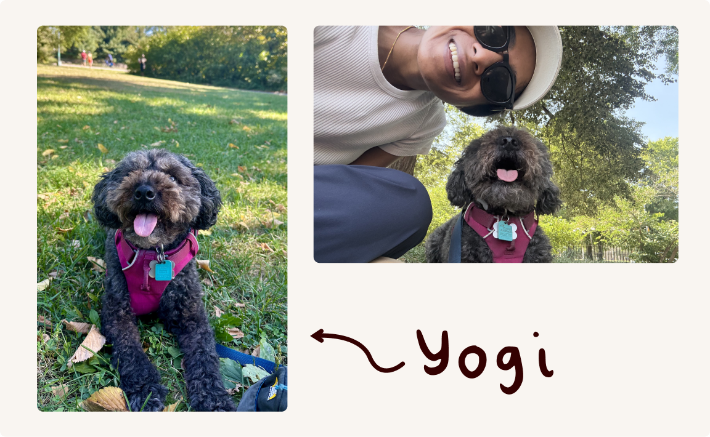
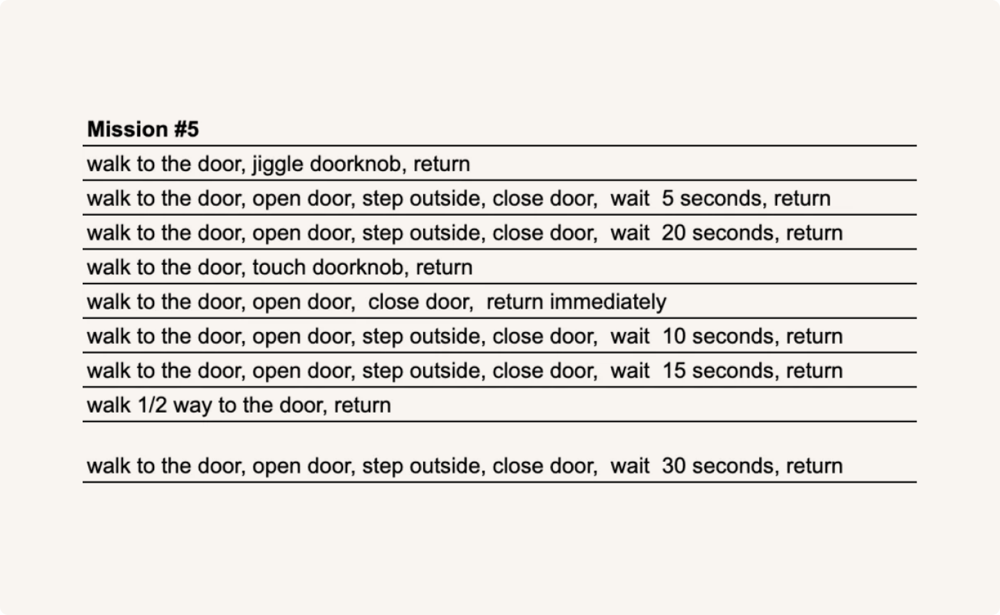
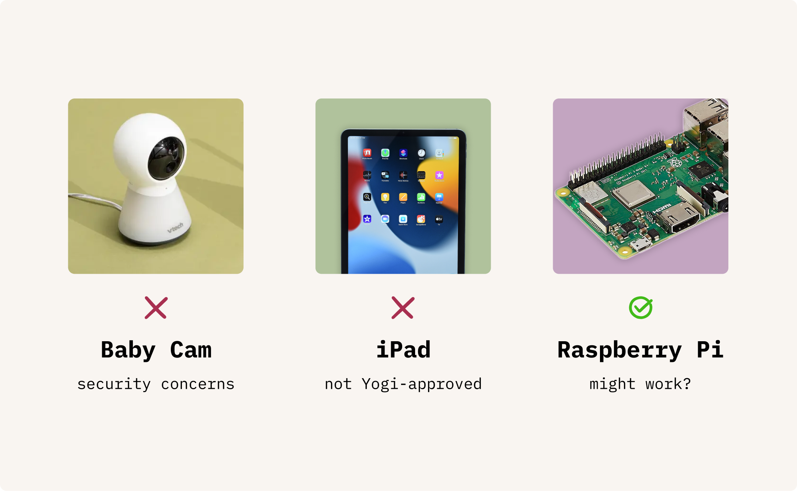
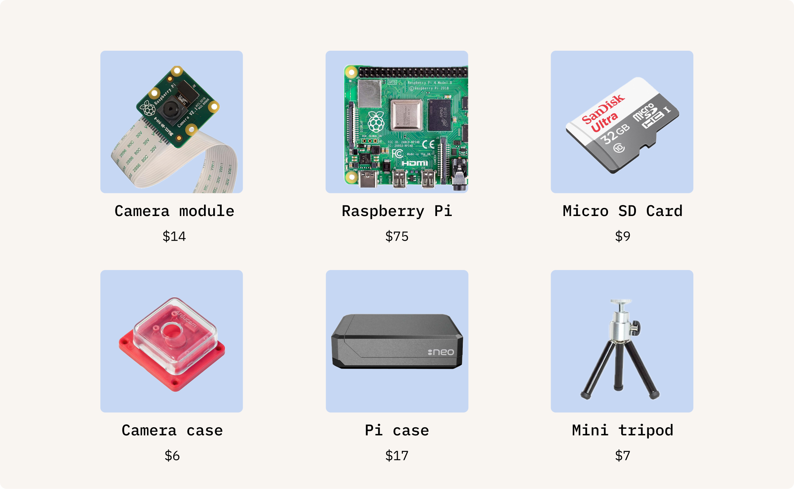
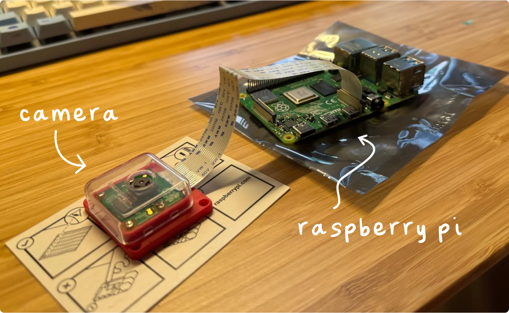
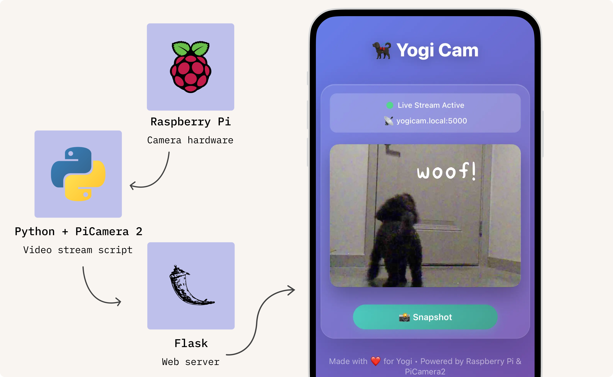
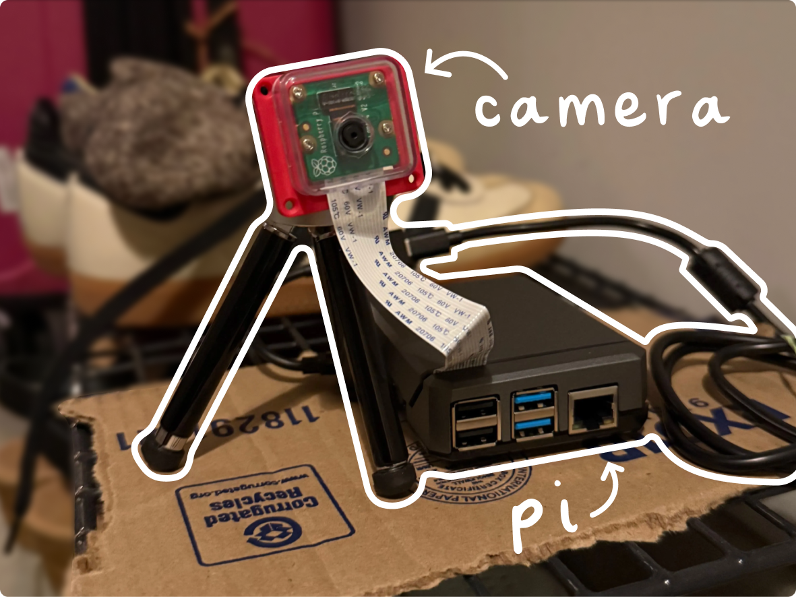
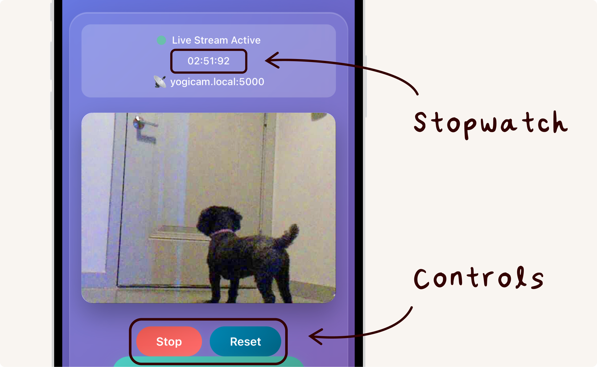
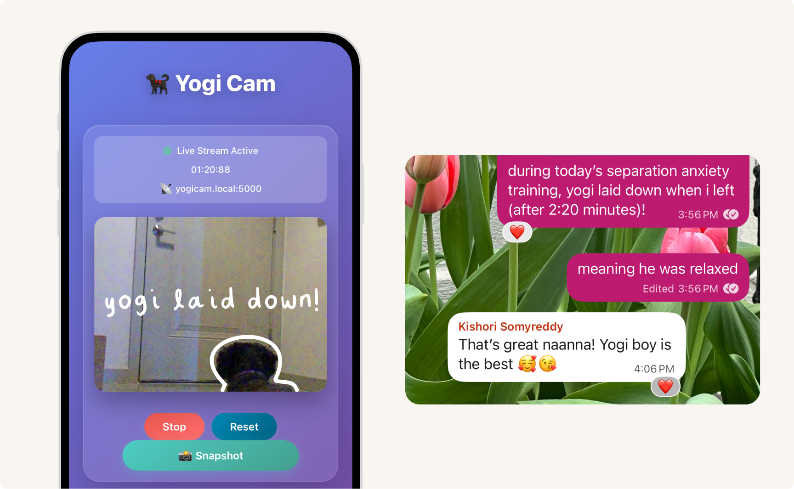

# How I Built YogiCam (a DIY doggy cam)

### TL;DR
I built a doggy cam (using Claude and Raspberry Pi) to train my dog with separation anxiety.

Before, he’d bark after being left alone for 3 seconds. Now, he can go 30+ minutes without barking!

**Here’s what I used:**

- Raspberry Pi with a camera module
- Python + PiCamera2 + Flask to livestream to a HTML site
- Ngrok to view the site from any network
- Claude to write the code and connect everything

 

## Hey there!

I’m Harshita. I’m a [Senior Product Manager](https://www.linkedin.com/in/hyerramreddy/) at Grammarly. And yes — I use em dashes when I write.

This is my dog Yogi. I adopted him 6 years ago, and we’ve lived in 3 states (TX, NY, and NJ) and walked over 2,800 miles together.

By age three, Yogi had lived in four different homes. As a result, he developed [separation anxiety](https://en.wikipedia.org/wiki/Separation_anxiety_in_dogs) — he’d bark incessantly (every 5-10 seconds) if I left him alone. This year, I hired a trainer to help with Yogi’s separation anxiety. He gave us an 8-week training plan with daily exercises. Here's an example:

## Finding a webcam

Before training began, I needed a permanent baby cam to watch Yogi. I had a few options:

1. **Baby cam** — This was recommended by the trainer, but I had security concerns about being continuously recorded 👀
2. **iPad w/ FaceTime** — I’d tried this before, but Yogi was smart enough to realize iPad = alone time. He’d bark immediately.
3. **Raspberry Pi** — I didn’t consider this until I saw [PewDiePie's video](https://www.youtube.com/watch?v=pgeTa1PV_40) where he built a webcam to watch his dog in the car, complete with a temperature sensor and 3D-printed case.

The last option was the most viable (and seemed fun). I was already using AI at work (V0, Figma Make, and Claude), so I decided to try it out.

## Building an MVP

### Getting started

I started by asking:

> *Help me design a raspberry pi baby cam to use to watch my dog while i train him for separation anxiety*
>
> *Claude: Certainly! Here's what you'll need…*

$127 later, I had everything I needed to build YogiCam.

### The basics

I gave myself Memorial Day weekend to build an MVP of YogiCam. I followed [Raspberry Pi's tutorial](https://www.raspberrypi.com/documentation/computers/getting-started.html) to set up the operating system, then [another](https://projects.raspberrypi.org/en/projects/getting-started-with-picamera) to connect the camera module.

### The code

I gave Claude the product requirements for YogiCam:

> - I can permanently set up the webcam in my apartment
> - The webcam livestreams to my phone via a web link
> - The livestream includes both video and audio

I got a Python script that captured video, turned it into a livestream, and rendered it on a webpage using Flask, HTML, and CSS.

But the livestream wouldn't show up 😭

After hours of debugging, I found [this blog post](https://kamranicus.com/building-a-raspberry-pi-3-baby-monitor/) about a similar project. The author used PiCamera2 (a newer Python library for Raspberry Pi cameras), whereas I was suggested to use LibCamera (an older open-source library).

After switching libraries, it worked! 🎉

## It works! Now what?

### A stable camera setup

My camera setup left much to be desired: an exposed Raspberry Pi board and a dangling camera. One wrong move, and whole thing could fall apart.

So, I ordered a mini tripod + Raspberry Pi case, and secured them on top of my shoe rack using leftover cardboard and a rubber band 😅 

### A stopwatch to time our sessions

During each training session, I time how long Yogi is alone and note timestamps for the trainer, like this:

> *He barked at 0:14, 0:22, 0:29. I was outside for a total of 47 seconds. It took until 0:05 for him to reach the door…*
> 

Every session, I’d open the stopwatch app, press Start, and *then* open YogiCam. Those extra steps started to annoy me.

I solved this by adding a stopwatch feature, so I can watch Yogi and time his sessions in one place.

### Accessing YogiCam via cellular data

By week 3, Yogi graduated to more than 1 minute alone! 👏 But as I walked farther from my apartment during these longer sessions, I started losing connection to YogiCam.

YogiCam ran on `localhost`, which meant that my phone and the Raspberry Pi must be on the same WiFi. Once I got far enough away, I’d lose WiFi… and YogiCam access.

I thought this was YogiCam's limit — I didn't think the issue was solvable, so I never thought to dig further. I just stood by my door during training.

One day, I was talking about my app and its limitations with an engineer. They suggested ngrok, which creates a public URL for my local server. This meant I could access YogiCam from anywhere — even on cellular data.

I set it up and it worked!

## What’s next?

### Audio recording

So far, I've been standing in my building's hallway during training sessions to hear Yogi’s barks. Now that I can use go outside of by building and stay connected (thanks to ngrok), there's a new issue: YogiCam doesn't capture audio.

To solve this, I can attach a USB microphone to the Pi and update the Python script to stream audio. I could even add automatic bark detection that logs barks above a certain dB threshold.

### One-click start

Starting YogiCam requires a few manual steps (listed in [instructions.md](instructions.md)). This ends up taking 2-3 minutes each time.

Instead, I could automate this process with the press of a physical button. It would trigger a bash script to run the Python code, start ngrok, and text me the link via SMS.

## Reflections

### Building with AI

Looking back, it’s amazing that I could go from an idea to a working product in ~3 weeks. Especially since it’s been more than 5 years since I coded.

LLMs have made programming simple, so I could focus on the fun part: building features that solve real problems. Like adding the stopwatch. Polishing the UI. Even opening `vim` and feeling like an engineer again.

### **YogiCam’s impact**

Before, Yogi would bark after 3 seconds alone. With the help of YogiCam, our trainer, and some anxiety meds, he can now go 30+ minutes without barking. All in just 6 weeks!

It was fun using YogiCam to document milestones, like when Yogi laid down. Yes, that’s a big deal 😅 I had to text my family to celebrate:

## References

**Raspberry Pi Setup**

- [Raspberry Pi setup instructions](https://www.raspberrypi.com/documentation/computers/getting-started.html)
- [Camera module setup instructions](https://projects.raspberrypi.org/en/projects/getting-started-with-picamera)

**PiCamera2 Setup**

- [PiCamera2 tutorial by RandomNerdTutorials](https://randomnerdtutorials.com/raspberry-pi-mjpeg-streaming-web-server-picamera2/)
- [PiCamera2 Baby Monitor blog post by kamranicus](https://kamranicus.com/building-a-raspberry-pi-3-baby-monitor/)

## Find me online

- 💼 [LinkedIn](https://www.linkedin.com/in/hyerramreddy/)
- 🍳 [Cooking YouTube](https://www.youtube.com/@souschefharshibar)
- 📺 [Tech YouTube](https://www.youtube.com/c/harshibar)
- 📸 [Instagram](https://www.instagram.com/harshibar/)
- 🏃🏽 [Strava](https://strava.app.link/D8dWo5Yp5Tb)
